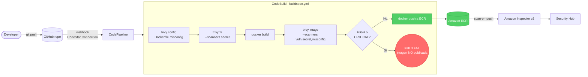

# Diagrama de arquitectura

Pega esto en cualquier renderer Mermaid (GitHub lo renderiza nativamente).



## Mapeo de la cadena de defensa

```
TIEMPO ──────────────────────────────────────────────────────►
 │
 ├─ pre-commit (opcional)    trivy config / trivy fs local
 │
 ├─ CI (CodePipeline)        trivy config + trivy fs + trivy image  ← ★ workshop
 │                           (security gate: bloquea push a ECR)
 │
 ├─ Registry (ECR)           Inspector v2 scan-on-push + continuous
 │                           findings -> Security Hub -> EventBridge
 │
 ├─ Admission (EKS)          Trivy Operator / Kyverno / OPA Gatekeeper
 │                           valida la imagen antes del Pod admission
 │
 └─ Runtime                  Falco / GuardDuty Runtime Monitoring
                             detecta comportamiento anomalo (ej. nc reverse shell)
```

## Decisiones clave

- **Por qué Trivy en CodeBuild y no Inspector solo:** Inspector funciona *después* del push. Trivy en CodeBuild es el primer punto donde podemos rechazar la imagen sin dejar artefactos en el registry. Defense in depth: usamos los dos.
- **Por qué `--ignore-unfixed` en `trivy image`:** evita ruido por CVEs sin parche disponible. Para el workshop lo dejamos activo; en proyectos reales se evalúa por tipo de carga.
- **Por qué `IMAGE_TAG = git-sha`:** cada imagen es trazable a un commit. Combinado con `ImageTagMutability: IMMUTABLE` en ECR garantiza que `latest` no se sobrescribe accidentalmente con algo viejo.
